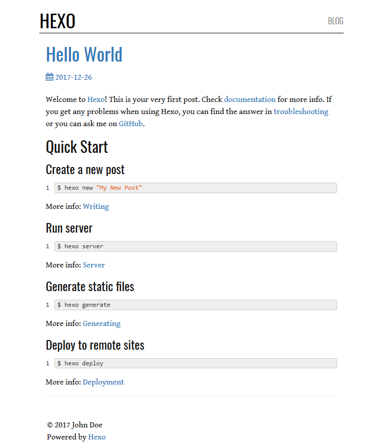

# hexo-theme-clarity

Based on [Hexo Bootstrap Blog](https://github.com/cgmartin/hexo-theme-bootstrap-blog) theme.

### Install

```bash
$ git clone https://github.com/josevh/hexo-theme-clarity.git themes/clarity
```
### Configure
Language configuration is **required**.
```yml
language:
  - en
theme_config:
  # Header
  navbar_brand: 
```

### Enable

Modify the `theme` setting in `_config.yml` to `bootstrap-blog`.

### Update

```bash
cd themes/clarity
git pull
```

### FYI
- **Nav**:
  - If more than one language specified, will have dropdown in nav to other languages' index.
    - It is assumed that the default language, first in language list, is at root, `/`.
    - It is assumed that secondary languages follow the following paths: `/:lang/`.
    - Tested with [hexo-generator-index-i18n](https://github.com/xcatliu/hexo-generator-index-i18n).
- **Pages**:
  - To list pages in nav, add to their front matter: `in_nav: true`.
  - To hide dates from pages, add to their front matter: `hide_date: true`.

### Contribute
Theme is far from perfect. Some layouts may not be generic enough. Feel free to fork, branch, and submit a pull request.

#### Screenshot
